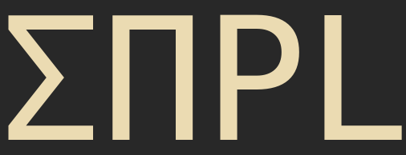

<p align="center">

</p>
<br>

A small DSL for programming [`sppl`](https://github.com/probcomp/sppl) across [PythonCall.jl](https://github.com/cjdoris/PythonCall.jl).

## Example usage

Allows the usage of direct string macros:

```julia
spn = sppl"""
Nationality   ~= choice({'India': 0.5, 'USA': 0.5})
if (Nationality == 'India'):
    Perfect       ~= bernoulli(p=0.10)
    if (Perfect == 1):  
        GPA ~= atomic(loc=10)
    else:               
        GPA ~= uniform(loc=0, scale=10)
else:
    Perfect       ~= bernoulli(p=0.15)
    if (Perfect == 1):  
        GPA ~= atomic(loc=4)
    else:               
        GPA ~= uniform(loc=0, scale=4)
"""
```

as well as the usage of a native macro with native structures:

```julia
spn = @sppl begin
    nationality ~ SPPL.Choice([:India => 0.5, :USA => 0.5])
    perfect ~ SPPL.Bernoulli(0.1)
    gpa ~ SPPL.Atomic(4)
end
println(spn)
```

```
(nationality = <py Identity('nationality')>, 
 perfect = <py Identity('perfect')>, 
 gpa = <py Identity('gpa')>, 
 model = <py sppl.spe.ProductSPE object at 0x1e6ce3d60>)
```

Of course, you can use native abstractions:

```julia
@sppl function foo(x::Float64)
    nationality ~ SPPL.Choice([:India => x, :USA => 1 - x])
    perfect ~ SPPL.Bernoulli(0.1)
    gpa ~ SPPL.Atomic(4)
end
```

which expands to produce a generator:

```
:(function foo(x::Float64)
      gpa = Main.IndianGPA.SPPL.Id(:gpa)
      nationality = Main.IndianGPA.SPPL.Id(:nationality)
      perfect = Main.IndianGPA.SPPL.Id(:perfect)
      command = Main.IndianGPA.SPPL.Sequence(
          Main.IndianGPA.SPPL.Sample(nationality, 
            SPPL.Choice([:India => x, :USA => 1 - x])), 
          Main.IndianGPA.SPPL.Sample(perfect, SPPL.Bernoulli(0.1)),
          Main.IndianGPA.SPPL.Sample(gpa, SPPL.Atomic(4))
        )
      model = command.interpret()
      namespace = (nationality = Main.IndianGPA.SPPL.Id(:nationality), 
                   perfect = Main.IndianGPA.SPPL.Id(:perfect), 
                   gpa = Main.IndianGPA.SPPL.Id(:gpa), 
                   model = model)
      namespace
  end)
```

## Syntax

There are a few special pieces of syntax which the user should keep in mind. Some of these points make the macro parsing unambiguous, others are more for convenience.

- `Sample` statements are expressed using `~` syntax.
- `Transform` expressions (a polynomial for example, expressed in Python as `X[1] ~ 8 * W[2]**2 + 5`) are specified a "special" operator `.>`.
- The Julia ternary expression `foo ? b1 : b2` is allowed - this desugars into `IfElse`.
- Array declarations are performed using the library-provided `array` function interface. Array declarations must be made (!) before indexing/use - or else macro parsing will return an error.
- `==` desugars to `<<` on the Python side (this creates an `event` - a condition). 
- The `for` expression is allowed - but you are restricted to only supply `UnitRange{Int64}` instances for the parsing/semantics to work properly.

Examples of each of these points can be found in the [`examples` directory](https://github.com/femtomc/SPPL.jl/tree/master/examples). These `examples` come directly from the [sppl Jupyter notebooks](https://github.com/probcomp/sppl/tree/master/examples). If you'd like to help port these over, just setup a PR!
